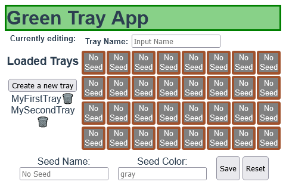

# Green Tray
"This was created during my time as a student at Code Chrysalis."

Green Tray is an app which keeps track of the seeds sown in a seedling tray. The app allows for saving and editing of your trays saved onto a database!

## Getting Started

These instructions will get you a copy of the project up and running on your local machine for development and testing purposes.

### Installing

To run this application locally, you will need Git and Node.js installed on your computer.

```bash
# clone this repo
$ git clone https://github.com/leewes5928/green_tray.git

# change directory to this repo
$ cd green_tray

# install dependencies
$ yarn install
```

You will also need to create a database in psql

```SQL
# create a database
$ CREATE DATABASE tray;
```

Once the database has been created, you can now start your Vue and Knex servers

```bash
# start express server
$ yarn start

# start developer server
$ yarn dev
```

A Vue application should now be running on localhost:8080.



## Built With

- [Vue.js](https://vuejs.org/) - A JavaScript library for building user interfaces
- [Knex.js](https://knexjs.org/) - SQL Query Builder
- [PostgreSQL](https://www.postgresql.org/) - Object-relational database system
- [Node.js](https://nodejs.org/en/) - JavaScript runtime
- [Express](https://expressjs.com/) - Web framework for Node.js
- [Heroku](https://www.heroku.com/) - Deployment

## Author

- **Wesley Lee** - [leewes5928](https://github.com/leewes5928)